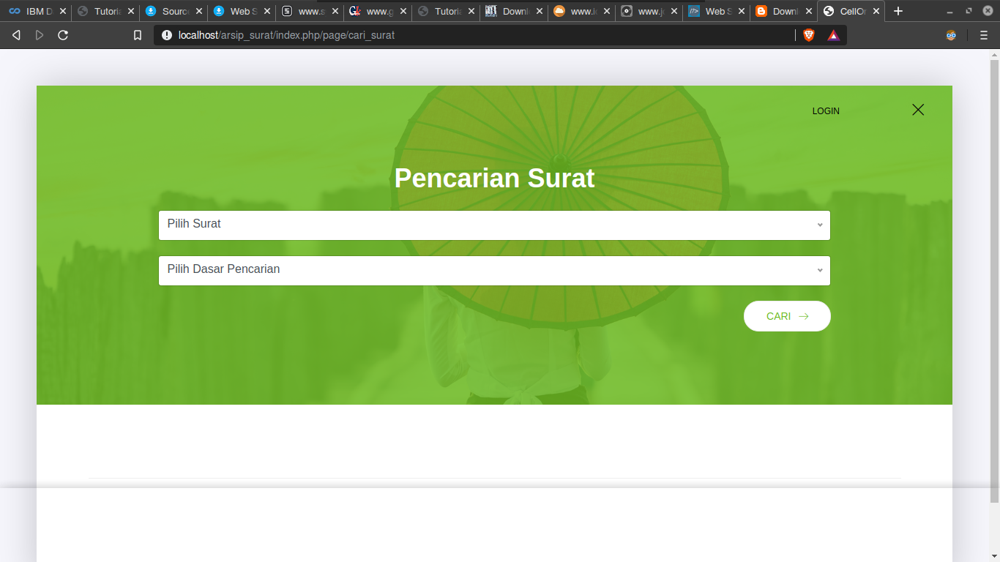
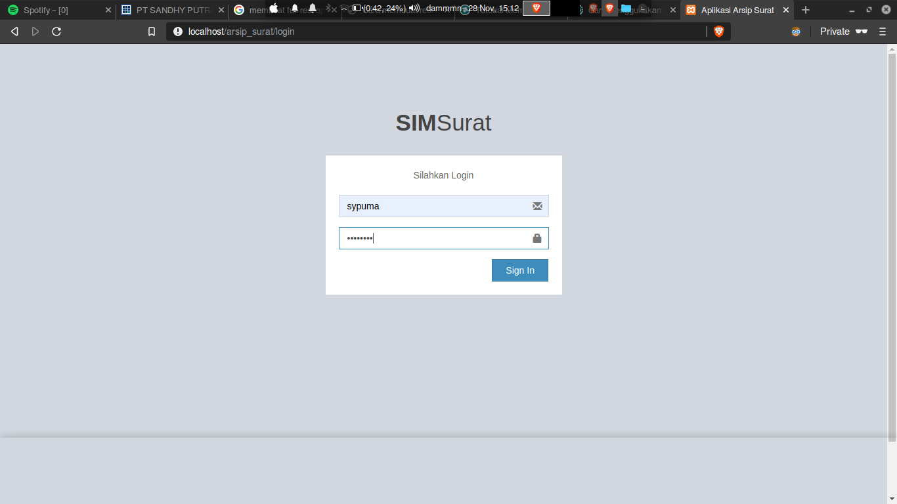
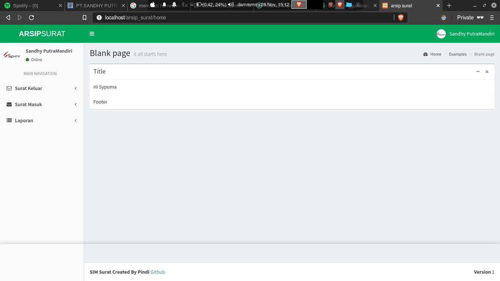
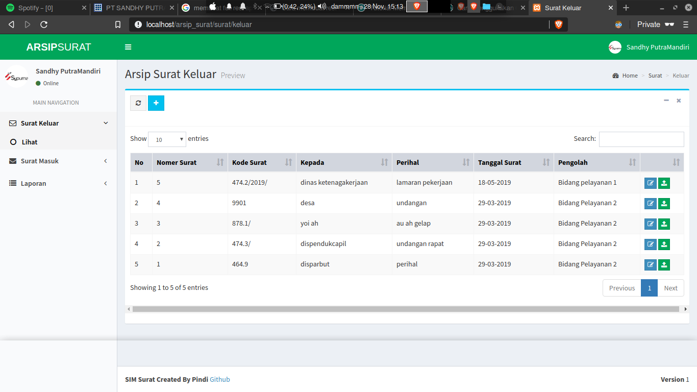
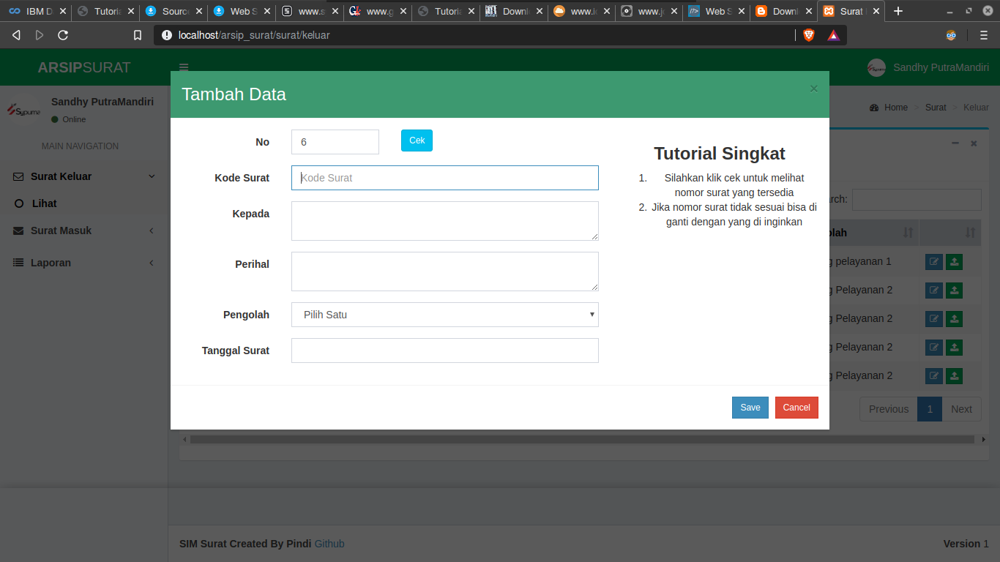
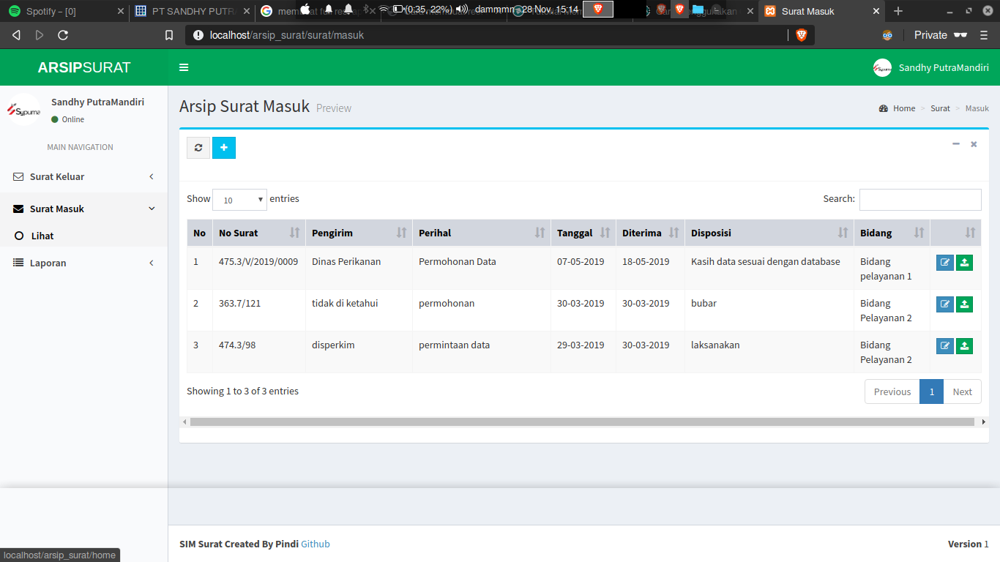
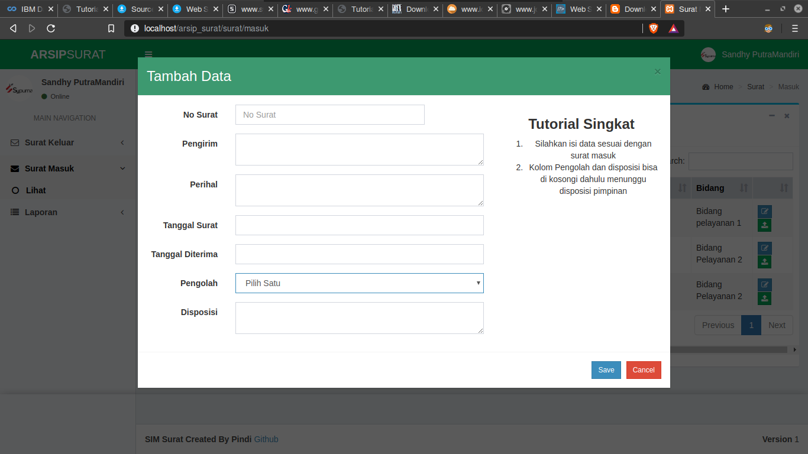
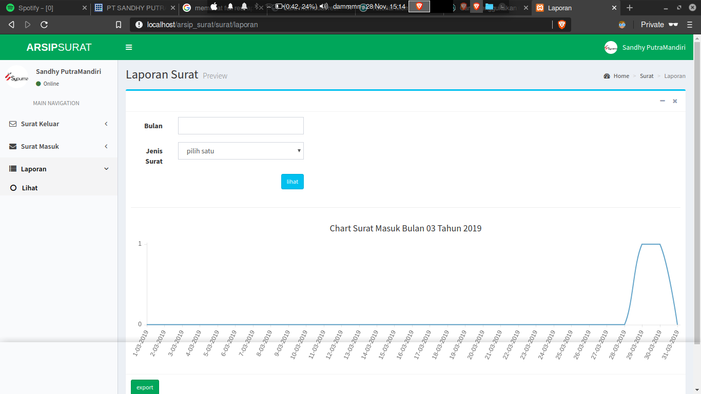

# BAB 4

## Pemrogaman Berbasis obyek
_Object Oriented Programming (OOP)_ atau Pemrogaman Berbasis  obyek merupakan paradikma pemprograman yang berorientasi pada obyek. Semua paradigma ini akan dibungkus dalam beberapa kelas – kelas atau object object yang terlihat terstuktur yang nantinya setiap obyek dapat menerima pesan,memproses pesan dan mengirim pesan ke obyek lain. OOP ini digunakan untuk mengatasi keterbatasan pada bahasa pemprograman tradisional. Dalam konsep OOP, semua masalah dibagi dalam obyek obyek karena konsep data dan fungsi – fungsi yang akan mengoperasikan digabungkan menjadi satu kesatuan yang dapat disebut sebagai obyek.
Secara sederhana obyek sendiri adalah kumpulan variable dan fungsi yang dibungkus menjadi satu tempat atau kesatuan. Dalam sebuah obyek diciptakan memalui sebuah kelas atau dikenal dengan istilah instan of class . Didalam obyek sendiri mempunyai 2 elemen utama :
* Attributes : merupakan nilai – nilai yang tersimpan dalam obyek tersebut dan secara langsung maupun tidak langsung untuk menentukan karakteristik dari obyek tersebut.
* Method : ini merupakan suatu aksi yang akan dijalankan atau dikerjakan obyek tersebut.
[sumber: Perkumpulan AirPutih, _Panduan Penggunaan Aplikasi FOSS CodeIgniter_, Jakarta :2014 ](http://www.airputih.or.id/file/file_ebook/bL29_Panduan_CodeIgniter.pdf)

## MVC
Design-pattern MVC telah diterapkan dibeberapa pengembangan aplikasi diantaranya pada: pendaftaran mahasiswa baru online (Fathiah,2013), sistem informasi keuangan (Hartomo, 2009), kuis online adaftif (Hidayat, 2012). Hasil menunjukan bahwa penerapan Design-pattern MVC lebih baik dari pada pengembangan aplikasi secara konvensional (Arochman, 2016). “Salah satu konsep yang dibuat oleh pakar pemrograman adalah memecah sebuah aplikas web menjadi tiga bagian yaitu model yang berkaitan dengan operasi yang berhubungan dengan basis data, view yang berhubungan dengan antarmuka aplikasi dan terakhir controller yang berhubungan dengan logika aplikasi dan mengendalikan alur data antara view dan controller konsep ini merupakan pengembangan dari konsep pemrograman berorientasi obyek dan dalam pemrograman dikenal dengan MVC” (Hasyrif SY, 2016) Pola MVC memecah aplikasi menjadi tiga modul: Model View Controller.
[sumber](http://jurnal.uinsu.ac.id/index.php/jistech/article/download/3908/1928)

_Model_ adalah   bagian   kode   program   yang menangani database,isi dari model merupakan bagian (fungsi-fungsi)     yang     berhubungan langsung   dengan databaseuntuk   mengelola data seperti memasukkan data, pembaruan data, hapus  data,  dan  lain-lain,  namun  tidak  dapat berhubungan langsung dengan bagian view.

_Tampilan (View)_ .Bagian   ini    mengandung keseluruhan    detail    dari    implementasi user interface.  Viewadalah  bagian  kode  program yang mengatur tampilan website.View biasanya berupa file  skrip  HTML. View juga  berfungsi menampilkan data  serta  inputan user, jadi view merupakan halaman web.

_Cara pemrosesan (Controller)_. Controller merupakan bagian yang menghubungkan model dan view.  Controllerberisi  perintah-perintah yang   bertanggung  jawab    untuk  memproses suatu  data  dan  mengirimkannya  ke  halaman web.   Controllerberfungsi   untuk   menerima requestdan     data     dari userkemudian menentukan   apa   yang   akan   diproses   oleh aplikasi.
[sumber](https://ejournal.bsi.ac.id/ejurnal/index.php/paradigma/article/view/5092/pdf)

##Codeigniter
Rekayasa web adalah suatu cabang ilmu baru yang didalamnya mempelajari pengembangan atau proses rekayasa sebuah aplikasi web dengan memanfaatkan framework. Framework adalah sebuah toolkit yang di dalamnya terdapat berbagai class-class yang dapat digunakan untuk membuat web. Dengan menggunakan framework ini, memungkinkan untuk membuat web dengan mudah dan cepat. Saat ini, tersedia berbagai macam framework yang bisa digunakan untuk mengembangkan web. Salah satunya adalah CodeIgniter. Untuk memperdalam pengetahuan tentang framework, maka penulis
mengembangkan Sistem Informasi Pendataan Surat saat kerja praktek mahasiswa pada prodi Ilmu Komputer UINSU dengan menggunakan framework CodeIgniter. Pemilihan framework CodeIgniter ini dikarenakan codeigniter dikembangkan oleh komunitas open source dan menurut penulis sangat mudah untuk dipelajari. Codeigniter juga sudah menggunakan konsep MVC (Models-View-Controller) yang memisahkan antara data dan presentasi sehingga memungkinkan pengembangan sebuah web dengan cepat dan memudahkan proses pengelolaan web tesebut. CodeIgniter merupakan sebuah framework yang
dibuat dengan menggunakan bahasa PHP, yang dapat digunakan untuk pengembangan web secara cepat. Adapun framework sendiri dapat diartikan sebagai suatu struktur pustaka-pustaka, kelas-kelas dan infrastruktur run-time yang dapat digunakan oleh programmer untuk mengembangkan aplikasi web secara cepat. Tujuan penggunaan framework adalah untuk mempermudah pengembang web mengembangkan aplikasi web yang robust secara cepat tanpa kehilangan fleksibilitas. 	
Berikut adalah fitur-fitur yang dimiliki oleh CodeIgniter:
* Model-View-Controller, merupakan fitur yang digunakan untuk mengembagkan aplikasi web dengan memisahkan antara logika bisnis dan presentasi.
* Support terhadap PHP 5 dan PHP 7.
* Template Engine Class, merupakan fitur CodeIgniter untuk memisahkan data dan presentasi.
* Scaffolding, merupakan fitur yang ada di framework CodeIgniter yang memungkinkan untuk membangun aplikasi cepat dan mudah untuk menambah, mengubah atau menghapus informasi dari basisdata. 
[sumber](https://media.neliti.com/media/publications/92627-ID-pemanfaatan-framework-codeigniter-dalam.pdf)

ada dalam framework ini dari versi sebelumnya. Perubahan ini membuat CodeIgniter
menjadikan lebih segar , kaya dan matang bandingkan framework lainnya. Perubahan
tersebut diantaranya adalah :
1. Menghilangkan PHP4 , karena php4 sudah tidak didukung oleh tim pengembang php dan apabila masih menggunakan php4 CodeIgniter ini akan terlihat ketinggalan jaman.
2. Menghilangkan fitur plugin, karena plugin mirip dengan helper yang menyebabkan kerancuan dalam pemprogramannya maka fitur ini dihilangkan.
3. Menghilangkan fitus Scaffolding , karena fitur ini nyaris tidak pernah digunakan oleh develop framework codeIgniter serta impelentasinya masih kurang bagus.
4. Menambahkan library drive, ini library khusus dimana kita dapat membuat drive dari library yang telah kita buat.
5. Penambahan Support Query String dan Command Line Exeution, dengan ini akan menjawab kesulitan kesulitan yang dialami pada versi sebelumnya.
6. Penambahan Library Cache, untuk meningkatkan kwalitas aplikasi makan library cache baik menggunakan apc, mencached maupun file base.
7. Penambahan fitur package , bertujuan untuk mempermudah distribusi dalam sebuah folder.
[sumber: Perkumpulan AirPutih, _Panduan Penggunaan Aplikasi FOSS CodeIgniter_, Jakarta :2014 ](http://www.airputih.or.id/file/file_ebook/bL29_Panduan_CodeIgniter.pdf)

## Keterangan Kode

Controller Bertugas melakukan set nilai default atau bisa dikatakan
menjalankan proses default ketika dijalankan dengan berisikan 

## Keterangan Aplikasi 
Aplikasi berisi login , home, dan menu lainnya.

### index

saat pertama menuju web aplikasi, akan menunjukkan halaman pencari. Disini agar mempermudah user untuk langsung mencari surat masuk atau surat keluar saat mendadak tanpa harus login terbelih dahulu dan membuat _user experience_ semakin baik.

### Login

dalam aplikasi login, user bisa memasukkan username dan password yang telah didaftarkan oleh admin. Password tidak berupa teks "telanjang" normal namun sudah di enkripsi untuk menambah keamanan data.

### Home

Setelah berhasil masuk, maka user akan dibawa dan berada di halaman _home_. Halaman ini menjadi penunjuk kepada user dengan beberapa menu yang tersedia. Ada menu surat keluar, surat masuk serta laporan. Menu surat keluar berfungsi untuk mengelola semua aktifitas surat keluar dari perusahaan dan menu surat masuk untuk mengelola semua aktifitas surat masuk menuju perusahaan.

### Surat Keluar

Di dalam halaman surat keluar, kita bisa melihat surat-surat apa saja yang keluar melalui perusahaan. Semua surat dalam surat keluar juga memiliki _property_ seperti kode surat, kepada siapa, perihal, dan lain-lain. Kita juga mencari surat berdasarkan nomor surat, kepada, perihal, tanggal dan pengolah.

Selain itu, di halaman surat keluar user juga bisa menambah surat sesuai dengan format yang telah ditentukan.

### Surat Masuk

Di dalam halaman surat masuk, kita bisa melihat surat-surat apa saja yang masuk ke dalam perusahaan. Surat-surat masuk  memiliki _property_ seperti kode surat, pengirim, perihal, dan lain-lain. Kita juga mencari surat berdasarkan nomor surat, kepada, perihal, tanggal dan pengolah.

Selain itu, di halaman surat keluar user juga bisa menambah surat sesuai dengan format yang telah ditentukan seperti ketetapan disposisi dan pengolah.

### Laporan

Laporan surat berisi mengenai statistika surat seperti jumlah yang masuk atau keluar pada waktu tertentu